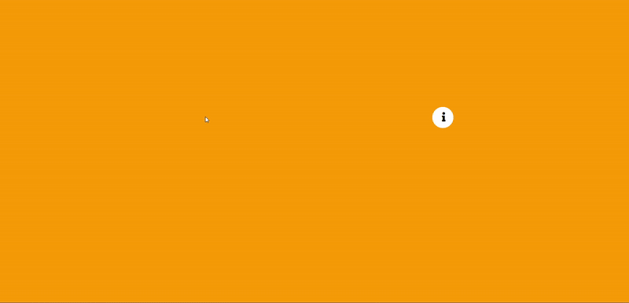
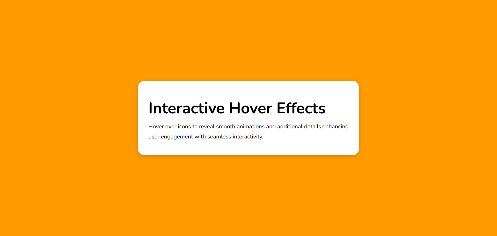
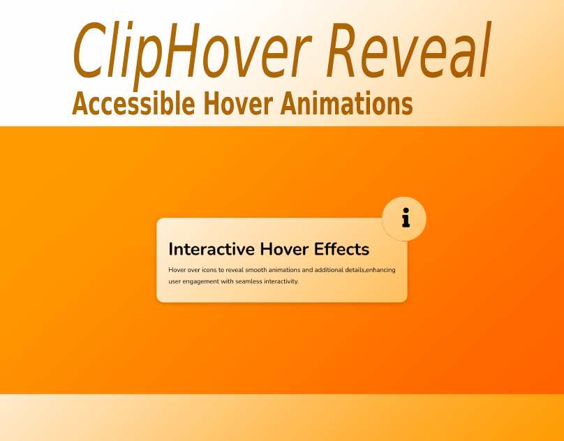

# ClipHover Reveal - Accessible Hover Animations

### Author
##### Virendra D. Verma

<a href="https://www.linkedin.com/in/dharmendraverma95/" target="_blank">LinkedIn Profile </a>

<a href="https://www.behance.net/dhirukumar" target="_blank">Behance Profile </a>

# Project Overview
**ClipHover Reveal** is an innovative, accessible hover animation effect designed to add smooth clip path transitions and reveal hidden content when users interact with icons. It’s perfect for modern web designs, providing an engaging and keyboard-friendly user experience.

## Features
- **Clip Path Animations**: Elegant hover effects with clip path transitions for icons.
- **Accessible**: Fully keyboard accessible for users with disabilities.
- **Smooth Interactions**: Seamless hover animations that reveal additional information.
- **Customizable**: Easily change hover styles, colors, and effects to fit your design.
- **Responsive**: Works flawlessly on all screen sizes and devices.

# Preview
ClipHover Reveal Card Design Section
 

 
ClipHover Reveal Card Design Section Start & End Point 
 

 
ClipHover Reveal Card Design Section UI UX Layout Start & End Point
 

 
ClipHover Reveal Card Design Section UI UX Layout
 

 
Cover
 

 

### Technologies Used
<ul>
  <li>Graphic Design Software: Photoshop, Figma (for mockups)</li>
  <li>Web Tools (Optional): HTML5, CSS3 for any digital presentations or landing pages</li>
</ul>